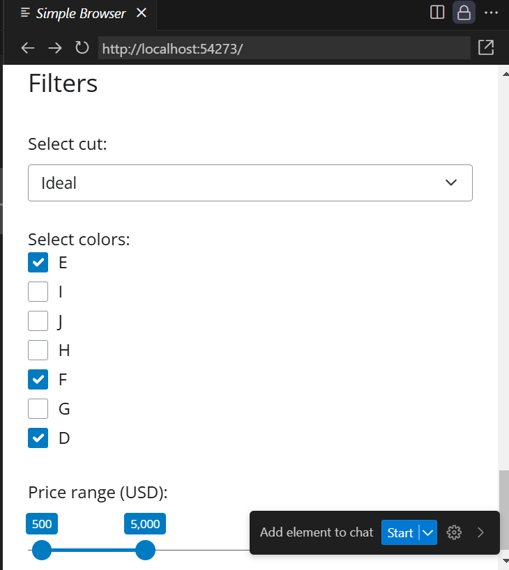
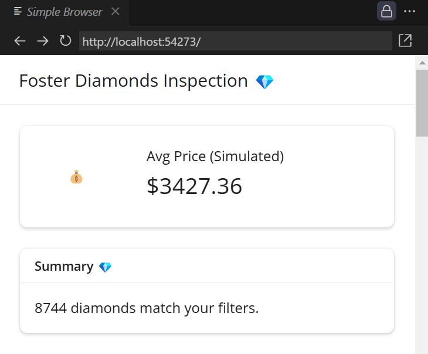
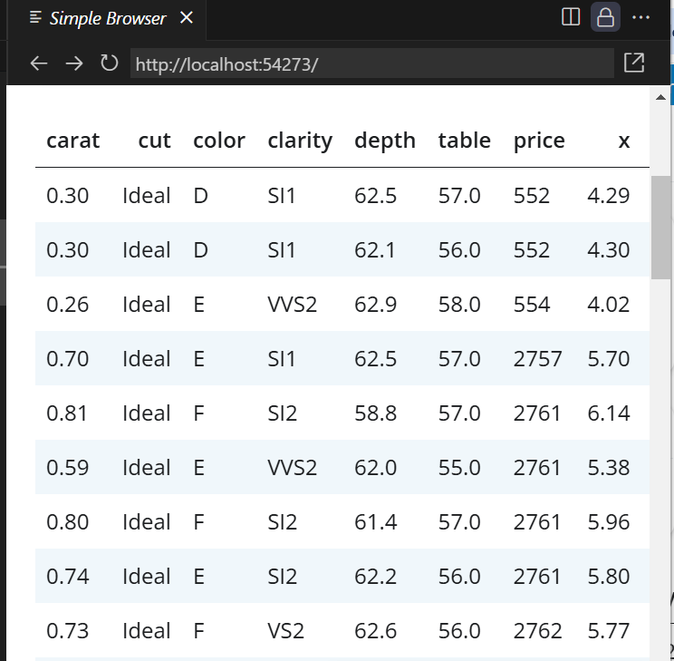
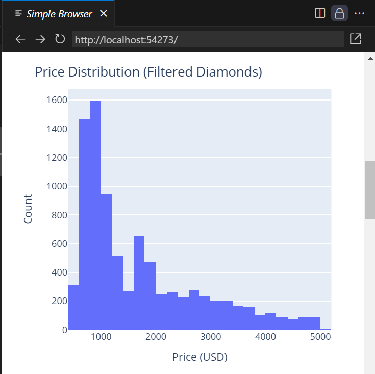
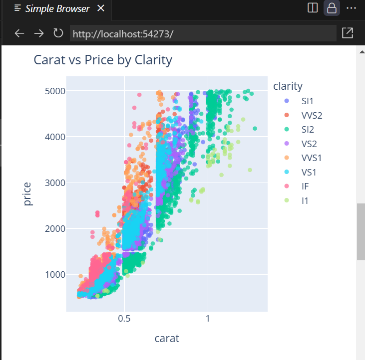
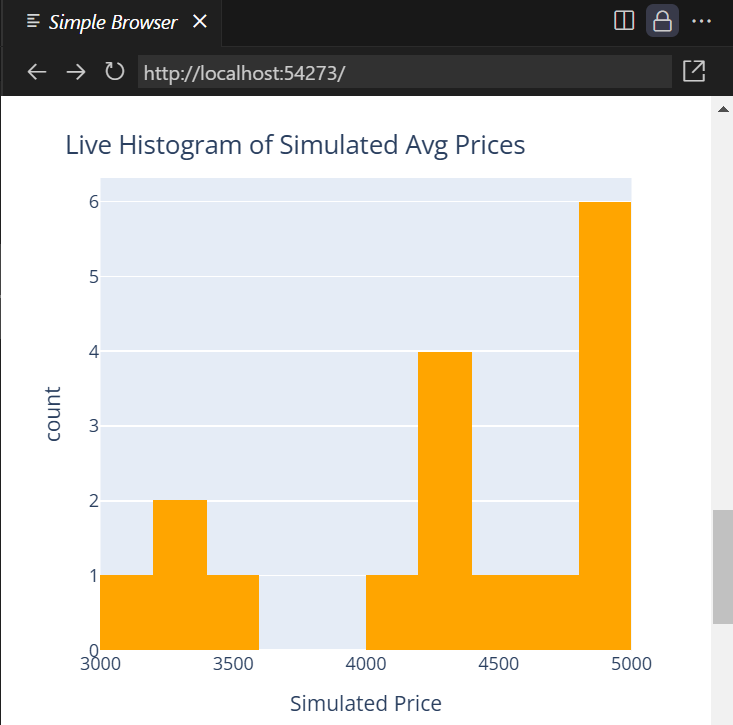
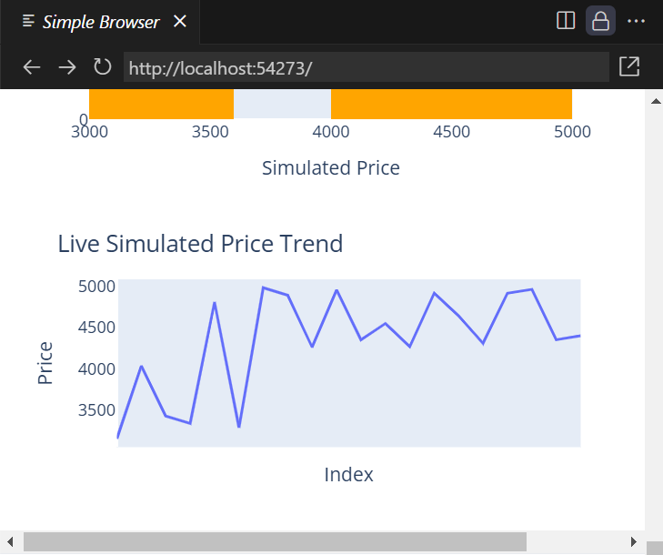

# Foster Diamonds Inspection 💎
## Author: Lindsay Foster
## Date: July 2025
This dashboard explores the Seaborn Diamonds dataset using PyShiny and Plotly.
It allows users to filter diamonds by cut, color, and price range and view interactive charts, tables, and a live simulated KPI with both histogram and sparkline visualizations.

## Features
### Reactive Aspects
@reactive.calc: filtered_data() dynamically updates whenever sidebar inputs change.

All outputs (text, table, plots) depend on this reactive dataset.

### UI Inputs
Cut (Dropdown) – Select a single cut (e.g., Ideal, Premium).

Color (Checkbox Group) – Select multiple color grades.

Price Range (Slider) – Adjust the minimum and maximum diamond price.

### Sidebar Components
Contains all filtering inputs for controlling the dataset.

### Main Content
Summary Card (Text Output) – Shows count of diamonds matching filters.

HTML Table (First 10 Rows) – Displays filtered data without requiring Jinja2.

Histogram (Matplotlib + Seaborn) – Price distribution of filtered diamonds.

Scatterplot (Matplotlib + Seaborn) – Carat vs Price, colored by clarity.

### Dataset
Uses the built-in Seaborn diamonds dataset:

54,000 rows of diamond data

Columns: carat, cut, color, clarity, price, dimensions (x, y, z)

### How It Meets Project Requirements
Reactive calc: filtered_data() used by text, table, and plots.

UI Inputs in Sidebar: Dropdown, checkbox group, slider.

Main Content Outputs: Card with text, table, two charts.

Template: Uses ui.page_opts (basic template, no columns or navigation required).

Visual Enhancements: Emojis added to title and summary for engagement.

## Additional Features (Live Simulation)
#### Simulated Metric
A reactive calc fake_metric() generates a random “average price” every 5 seconds to mimic live data.

Displayed in a value box with an emoji: 💰.

Automatically refreshes without user input (demonstrates reactive.invalidate_later()).

#### Live Histogram
Tracks the last 50 simulated metric values using a reactive value price_history.

Uses @reactive.effect combined with @reactive.event(fake_metric) to append new data points only when fake_metric changes (avoiding infinite loops).

Plots a histogram (orange) of simulated price values updating every 5 seconds.

#### How It Works
Reactive Flow

fake_metric() → triggers every 5 seconds.

@reactive.effect listens for changes and appends to price_history.

simulated_price_histogram() renders a histogram of recent values.

Performance Handling

price_history is trimmed to last 50 values to prevent memory bloat or slow rendering.

UI Placement

Value box and live histogram are shown in the main content area alongside filtered data visuals.

#### Project Requirement Highlights
Reactive Aspects:

filtered_data() for user-driven filtering

fake_metric() + price_history for time-driven updates

Multiple Output Types:

Static histogram & scatterplot (filtered diamonds)

Live histogram (simulated metric)

Summary card and HTML table

Demonstrates advanced reactivity:

Combination of reactive.calc, reactive.event, and reactive.value.

Reactive calc: reactive.calc()

Reactive effect/event: reactive.effect() and reactive.event()

Value box: ui.value_box()

Plot output: render.plot()

### Updated Features:

Live Sparkline: Minimal line chart showing real-time trend of simulated prices.

Enhancements

Plotly Interactive Charts

Replaced Matplotlib/Seaborn with Plotly for zoom, pan, and hover tooltips.

Allows users to export plots as images directly from the interface.

Empty Dataset Handling

Gracefully shows “No diamonds match your filters” message if no data matches filters.

Prevents errors when filters return 0 rows.

Live Sparkline Trend

Added minimalist line chart for real-time KPI trend.

Complements live histogram for better understanding of simulated metric.

How It Works
Reactive Design

filtered_data() updates whenever filter inputs change.

fake_metric() generates random price values every 5 seconds.

price_history stores the last 50 simulated values for histogram and sparkline.

All charts and tables reactively update based on these reactive values.

#### Helpful API References
Reactive calc: reactive.calc()

Reactive effect/event: reactive.effect() and reactive.event()

Value box: ui.value_box()

Plot output: render.plot()

### Resources
Dataset
Diamonds dataset (CSV)

Input Component API
ui.input_slider – Shiny Express API

Output Component API (Data)
ui.HTML – Shiny Express API

Output Component API (Charts)
render.plot – Shiny Express API

# View Live Here
[Playground Link](https://shinylive.io/py/app/#code=NobwRAdghgtgpmAXGKAHVA6VBPMAaMAYwHsIAXOcpMAYgAIBeJ5l1t9jzrzgHQnoAiAS1ikAJgGc6AUQAeqADbEATlDJDSdABQAFJWQXY6ANTjKJGiHQDuQsgAs6AZVRRlAawVCIcAJR96biDgkJC+ADNlYhg6CXtvbAw4eWU4CSkhGFQVMjoAVyE8Om9UPLIi1IgxMwiomLiE4qyculSoQnUANzha6Nj4iGxbMQBzODIM5uVcyurlAH1FYgNsPkzs6di4KAAjFSsoKQkICTWp3Ncqw7pr1DEzjZmoKuiHlqWVpJS0qVvZPgCdAAMsQoGI6GIRDBxFIxGpDuM+JDRFUpAxYicMEowfM4WQEWQtDwwMjoajif4IICALS0un0hmMpnMll0wEAJW2HSE3ToAGEoApCHkFGpLKd+HRWdKZbLaQCIAABNrc7oYQiCwhIuDhOjhIQKCipMS4+FaXyIPh0a10Yl2sAAMQNRohUJhdB2CPBmjyEjMxQgpQmGHtdqsNrEuvRpJh6uIOHNCptdHoTsN-p2RmFZCtEajEPCwEjwGJ2eJAF1GOiSmV1WVzeWkzbU86M1niEplLnrZHGAWi4XSx2VBWMEILBAtDWyHHO+bfI2qeHrS308oPUZUMohIQ4K1nmNu3QYN5Ftvd0UYFBZGed3vq4Ha1u7-NVBAxonlwW+8WtMXic+u4VnQAB86InhAt67r4dAAGTaP+YCAT0YCVgAPOB15QX4i5HqkZB5MoViRgqypcl0cDqpq2q6uEUDuHA8zwGQ57mpaX6hmATiZCKah7sx57aHkdx8VIcDdMoRgAKxbCQqK+CGYChl+KoUWOECdIKQh4oxopGloUmUsm+GEVYUR5FUWhvmI0QYBZQjhCoMBaAAzAADB5RRSR5bm+EUABMlKAgAKqohDuMe4yCfEEhkCoqyBuejExXFkl9qpPKUZpCh5HAWjAOWQVKhlao6uEcAdHwZHtGp4mUISdEMUxUU7pS1S6vMwk6dh8wpfFbFHn1aXoshvXjqliRjISMEANR0MAjWMQJO4Nkeo1DYkfqEhtwDUt5iCFSudAMXAqB0KKsV0N5dDZblEo0nKj1PfKkoAKoAJIPc933SgqBRYFAYzzPGExaOoBhwAwxIOsQsX+sIKKSHQ70nKgFXqJogC8G4AcTvEkU+oKKKOwKJDoW5UVtgOPkQgYBY1SesoA1fv99guUSjqtuYFJNta-3TvMfokx0RJfsmpZlHjR5i1xcBC7k2aWvgUs2oQ9jEHeEgMDGqIlkQEuoXZEBCAAjrl5oYHFXixeaeDK9agvo3AYhQ2A73VIKYbJkVyZ84+ZDzKrFXuHsN4jOZqAi8m0skJ2kuizaxJOLL6N0DHKgSIrtvx9aqvq7umva5Iutp12Bv2abeUKZb4023bWxy07DC6wIeO2mA0it9DFZHt7Nq+0GAteHMkdR9aAFJa+B4oVno9j2AOhJfu757lor1OAIFpx7Px7eAw3iEoXEi68ho4QfOM+z1esh7+Qf5ujr493qf17n3Xt2QwZnlXT5fl13DqAMAAIweR7gqegxhBS5ToAAIWIP8YqlA5h2SEDRG4nQRg9RDkzYy4xTLUwwO-eYWC36QMhuEYkAASEAi1mosRWr4AAvlvWe4MSYuwAILoLoAvO82huIwF4hQMQ-glbZ36MQawGo-Qu0xoABp3PY2iKvQJweQYBXjShqZQ9wICU0cP9TRYhsF9xpgY3q2xh6J1UeoowONuZLmTGRKoZgLbJBzF+dqsQrFuGwPMCgshprsW3iQCyuR0Qk0nATI0TtTT4nnHXEyRE9TEhAME8gDDXSIykFeMgqs6DYGIIRPUnMJCKTAXQYKuwSZVVmM4goqCJBeMkr4ypldAl5j7JEsw0S8RQE-MmByBYkhZDINgNpo8ElWH+gACWCgAWSBOzNCZ1YrYDYQAchLogY0ABuNZIEAByxAMlkiRtk3J+TCmdPMBgNCAB6VAIE7GDTIDABQzTib3kGfYcxWhgFV2IL1F5CgtCEAun6TWxJ8QfLoFCkm1JYrbjRvcfAAZqjXwdIKP0RQ9haLMAwXyeFcGJOmXMhZ9ggXvJJko7h+hDB0CmeNYgYdYDaDTFE8ECMTkSEpI4uYixaUJQ8etRlzLnKb3cfmK53SzRGRtAMyMQzUAjLGVHCZdBUCyAwH1UVWg7gYAEPCB0qh4BaBAI-ICSB5rlgYb4GCKY6BwGGZufQPMikjD7BqrVIrjV-nCEUa+5rp50AgDsbwmt3JFFYZDYkPDdx0GEAioQOwyiWFZZzJ28b76SBEbK60+oRh2REhQeYooLmElkNeccvi7BsJjYvVe68RFFGwJWiQ1aIYuz5AU8gdicEEUSfmspehlh0qcBqMgRoPjaAFKoXInQpCxr8NUxBZh+UjsFTqVObg1DzHndhIxPZJXppND0vpcrdQKsdUq0Z8SiVWE9RIcd+k9UGvxEa2AeUzVEG3TmS1BUiiBuJIgK1Nre55qEO6kamrH1qH0nXSMF9R4Bu-bO5ho9sAuxPqIoJw5lAu1BW4OwqxsMsJrdGsAM61A3QXYvTM-JRTbhGWhqO8Z2hEfxRgAA7KAlSd63VDoFfS71LKtD8MERmxd3Ll1OIWB8Qw9SeJ6WicK2KTKfXiuTD0j1E8NoYCmp+I8Azwl-nhDBJgdA3Iqr7Xgz12qfUvsNcaz9gG-3Wtta6-NHrNV2dgCPUeDm31OdNYnRTfFwSLqAxCeENrENR2Q2JpT4WkrMeTCGsNQC3KxeTFGl2QJMpCdU6KugxBdQJbC3QTh7rJMpZVrh3E45CD4UYn6CuEBdxN2JCoKe3cvy5taHxwdS56DDpWMCbwe4+T2DcLkUTrgPBeB8HqFQzhQtCO4YvUKiCeU1NkwKhTAjEs9QkHNzw42D1RfxNpl8un9NgftVM54YgSZbr9DYb5qRg1HK09gREX4jOUBM-iMz6JLO3v7fezVC28oBagO+k1X6IuudA66+gfI2gUHOuN1OU3NhaGO24U7i2Vkk2AxBTIgobiyDSH13sI0xD6scx+4LrsnH-EtW+D8xmem2oA-PZLlqek2qPJ5qDWIzsIboMhlGaLW4YbrU-FFOXiR5d5GVtbi7ymzCeV+fNhbuqloKYSOuFbZDji1juQkcQJFh20gwDFCgsXiOsOocKRNZaa3t36X+YiW2m4LhbvHatrA2+dp7vwWWbTqJGLvSEwsFAMH8pl1oCek9kAYAAFiTzsFP3vt7fIg+SlPbkeOEvB-xiAYAGHliAA)